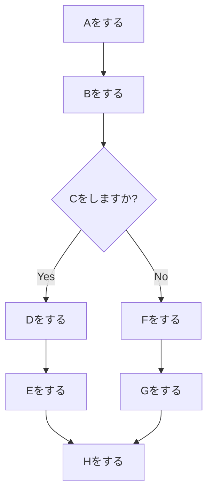
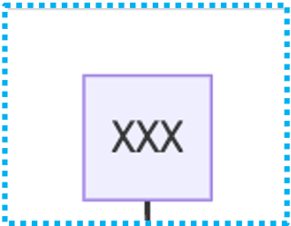
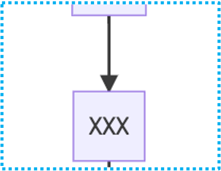
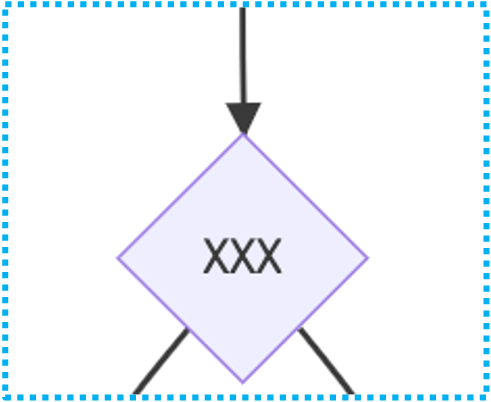
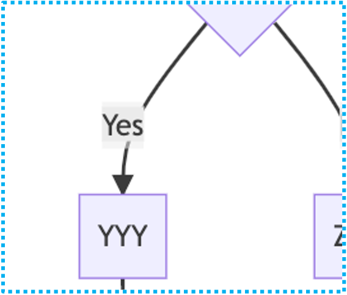
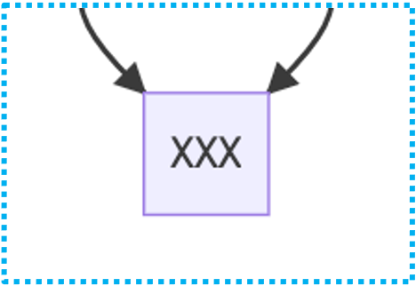
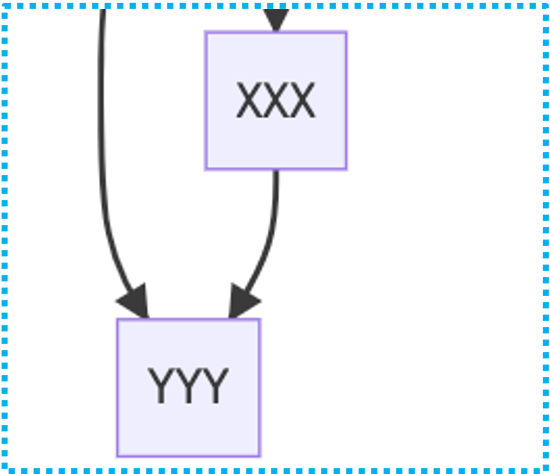

- お試し実行

```sh
. scripts/run_dev.sh
```

- コード生成

```sh
. scripts/build_runner.sh
```

# コメントチャートの書き方

- ソースコード内にインラインで書ける

## 例

```
// # NEW MyChart

...

// # Aをする

...

// # --> Bをする

...

// # --> C?{Cをしますか?}

...

// # C? -- Yes --> Dをする
// # --> Eをする

...

// # C? -- No --> Fをする
// # --> Gをする

...

// # Hをする
// -- 分岐の後なので合流が必要 --
// # Eをする --> Hをする
// # Gをする --> Hをする
```

<br>

# MyChart



<br>
<br>

## フォーマット

| **使用箇所**                 | **フォーマット**    | **図**                          |
| ---------------------------- | ------------------- | ------------------------------- |
| 新規チャート作成             | `NEW XXX`           |  |
| スタート                     | `XXX`               |  |
| それ以降                     | `--> XXX`           |  |
| 分岐点                       | `--> X?{XXX}`       |  |
| 分岐内                       | `X? -- Yes --> YYY` |  |
| 分岐終了直後(スタートと同じ) | `XXX`               |  |
| 任意の矢印                   | `XXX --> YYY`       |  |

<br>
<br>

## その他情報

- 分岐終了直後は矢印が途切れるので必要な矢印を付け足す
- `// #` でコメントアウトした部分のみ採用される
- 文字が長すぎる場合は `<br/>` で改行できる
